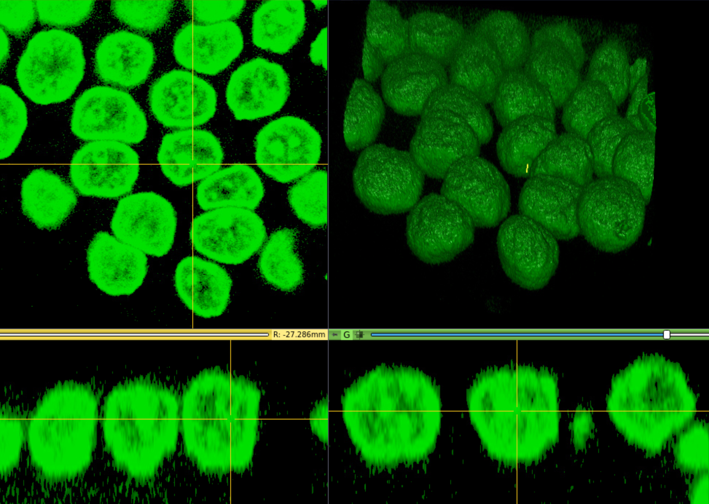

# About SlicerScope

SlicerScope is an open platform for whole slide histopathology image computing based on the highly successful 3D Slicer.SlicerScope has four specific analytical modules for staining decomposition, nucleus segmentation, and gland segmentation of 2D/3D histopathology images. It's open-source, extendable, facilitating the algorithmic, clinical, and transnational researches.

# What can SlicerScope do?
|                         Staining decomposition                         |                         Nucleus segmentation                         |                         Gland segmentation                         | 3D Pathology |
| :--------------------------------------------------------------------: | :------------------------------------------------------------------: | :----------------------------------------------------------------: |:----------------------------------------------------------------: |
|  |  |  |  |

# Contact us
If you encounter any problem, email <html><head><title>gaoyicn@outlook.com</title></head> <body><a href="mailto:gaoyicn@outlook.com">gaoyicn@outlook.com</a></body></html>
